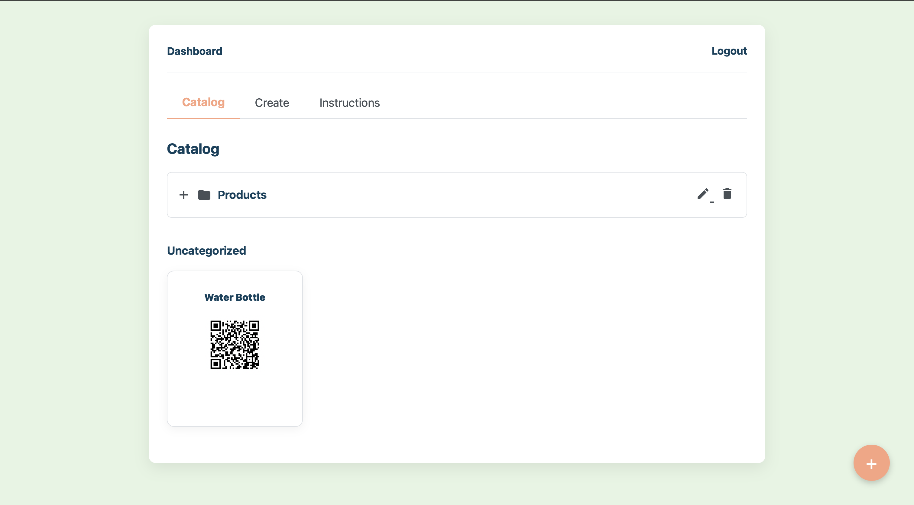
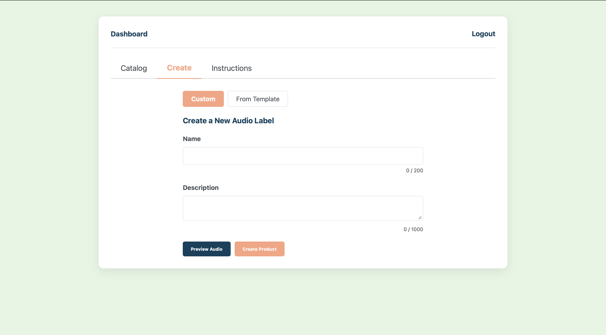

# BMS — Blind Management System

> **Accessible QR Audio Generator** — A web application that turns QR codes into an audio-first experience for visually impaired users.

---

## Overview

BMS allows businesses to generate QR codes embedded with spoken audio descriptions. Visually impaired users can scan these codes to hear product information, menus, or public notices — no sight required.

---

## Problem

For visually impaired people, everyday tasks like reading a menu, understanding a product label, or accessing public information can be frustrating and inaccessible. Tools designed to increase convenience — digital labels, QR codes, quick-access systems — rely almost entirely on visual elements, unintentionally excluding those who can't see.

**BMS removes these barriers.**

---

## Solution

With BMS, visually impaired users can:

- Access information **independently** without needing assistance
- Understand products, menus, and public information **in real time**
- Avoid the frustration of navigating complex or inaccessible interfaces
- Feel more **confident and included** in everyday environments

---

## Key Features

- Secure, login-protected business dashboard
- Product and folder management with drag-and-drop organization
- Reusable description templates
- Automatic QR code generation
- **Directional Audio QR Scanner** — an audio beacon that guides users to QR codes

### Directional Audio Scanner

The scanner uses spatial audio to guide users to a QR code before they scan it:

- A beep plays when a QR code is detected
- Sound shifts **left or right** based on the QR code's direction
- Beep **speed increases** as users get closer to the code

---

## Tech Stack

| Layer | Technology |
|---|---|
| Backend | Django (MVT architecture) |
| Frontend | Modern JavaScript (ES6 classes) |
| Audio System | Web Audio API (real-time spatial sound) |
| Database | Django ORM with migrations |
| Accessibility | ARIA roles and live regions |

---

## Quick Start

### 1. Clone the repository

```bash
git clone https://github.com/AaritKumar/blindmanagementsystem
cd accessible-qr-audio
```

### 2. Set up a virtual environment

```bash
python -m venv venv

# Mac/Linux
source venv/bin/activate

# Windows
venv\Scripts\activate
```

### 3. Install dependencies

```bash
pip install -r requirements.txt
```

### 4. Run migrations

```bash
python manage.py migrate
```

### 5. Start the server

```bash
python manage.py runserver
```

### 6. Open the app

Navigate to: [http://127.0.0.1:8000/](http://127.0.0.1:8000/)

---

## How It Works

**For Businesses:**
1. Log in to the secure dashboard
2. Create products and add spoken descriptions
3. Generate QR codes
4. Organize codes into folders for different use cases

**For Users:**
1. Open the BMS scanner
2. Use the audio beacon to locate and scan a QR code
3. Hear the audio description automatically

---

## Design Philosophy

> *Accessibility is not a feature — it's the foundation.*

BMS was not built by adapting a visual system. It was designed **from the ground up** to work without relying on sight.

---

## Screenshots

**Dashboard**



**QR Generation**



---

## Demo

[Link to demo video]

---

## License

[Add license here]